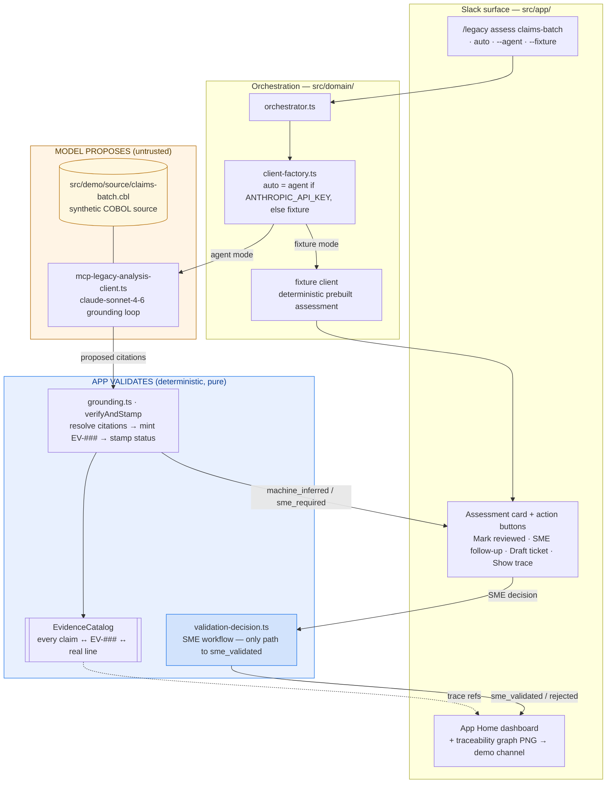

# Legacy Modernization Commander

Slack-native command center for enterprise legacy modernization teams.

Built by a modernization practitioner with 22 years across COBOL, OLTP, and mainframe legacy estates. This is the operator's view of where migration programs actually break — not in code conversion, but in the coordination of business rules, dependencies, and SME validation that conversion silently assumes is already done.

Legacy Modernization Commander turns a legacy module into a business-readable modernization assessment inside Slack: what the module does, which business rules it encodes, where migration risk concentrates, what SMEs must validate, and which work packages should move next. Built for the Slack Agent Builder Challenge as a focused, portfolio-grade agentic workflow.

## Demo command

    /legacy assess claims-batch

Returns a structured modernization assessment for a synthetic COBOL claims-batch module (`CLAIMS-BATCH`, z/OS batch, insurance claims adjudication).

## Three modes

The command runs in one of three modes:

| Mode | Invocation | Behavior |
| --- | --- | --- |
| **Auto** | `/legacy assess claims-batch` | Agent if `ANTHROPIC_API_KEY` is set, otherwise fixture. |
| **Agent** | `/legacy assess claims-batch --agent` | Live Claude grounding (`claude-sonnet-4-6`) against real COBOL source. |
| **Fixture** | `/legacy assess claims-batch --fixture` | Deterministic local fixture. No model call. |

Auto mode means the demo always works — with a key it grounds live; without one it falls back to a deterministic assessment of the same shape.

## The architectural boundary

This is the point of the project.

**The agent proposes a grounded assessment. The deterministic application layer owns SME validation state.**

Every claim the agent produces — risk level, each business rule, each work package — is stamped `machine_inferred` or `sme_required`. The model has no path to `sme_validated`. That status can only be reached through the application's SME validation workflow, and the type system enforces it: the agent's output type cannot express a validated claim. This is covered by adversarial tests that assert the model can never emit or escalate to a validated state.

The App Home dashboard reflects *validated workflow state*, not raw model output. Model-proposes / app-validates is enforced at the type level, not by convention.

## How grounding works (agent mode)

1. The model is given the real source (`src/demo/source/claims-batch.cbl`) and proposes citations — paragraph and line references — for each rule and risk it asserts.
2. `verifyAndStamp` (pure, no model in the loop) resolves each proposed reference against the actual source lines.
3. Resolved references mint catalog evidence (`EV-###`) in the `EvidenceCatalog`, each carrying a file/paragraph/line locator and the real excerpt.
4. Each claim is assigned a `validationStatus`. A claim whose citation does not resolve does not get to stand as grounded.

Every assertion in the assessment traces to a row in the evidence catalog. No catalog reference, no claim.

## Derived SME checklist

The model never emits a validation checklist. The application **derives** the `smeValidationChecklist` from the model's `unknowns`. This keeps the agent in its lane (surfacing what it doesn't know) and the application in its lane (owning the workflow that resolves it).

## Interactive Slack loop

The assessment is not a one-shot report. It is the entry point to a workflow.

The assessment card carries action buttons:

- **Mark reviewed**
- **SME follow-up**
- **Draft ticket**
- **Show trace**

Each SME decision updates the App Home live dashboard and posts a refreshed traceability graph (PNG) to the demo channel. The dashboard tracks validation state across the assessment as SMEs work through it — the workflow surface, not a static document.

## What is real vs. synthetic

Honest framing is a hard rule in this repo. Every claim maps to a visible artifact.

- **Real:** the agent grounding loop, citation verification against actual source lines, the evidence catalog, the type-enforced validation boundary, the interactive SME workflow, the traceability graph.
- **Synthetic and clearly labeled:** the `CLAIMS-BATCH` module and its source are a representative synthetic COBOL artifact, not customer code.
- **Not claimed:** production-grade COBOL parsing, live enterprise-system integration, or automatic ticket creation. Work packages are **drafts** for human review — nothing is filed in Jira.

Outputs are **case-file-ready** — grounded, traceable, and reviewable. They are an input to SME validation, not a substitute for it.

## Architecture

The `LegacyAnalysisClient` boundary lets a production version swap the agent for a real code-analysis backend, dependency mapper, or ticketing system without touching the Slack workflow layer.

## Setup

Install:

    npm install

Required environment variables (`.env`, never committed):

    SLACK_BOT_TOKEN=xoxb-...
    SLACK_SIGNING_SECRET=...
    SLACK_APP_TOKEN=xapp-...
    PORT=3000
    NODE_ENV=development

Optional — enables agent mode:

    ANTHROPIC_API_KEY=sk-ant-...

## Run

Deterministic local demo (no Slack, no key):

    npm run demo

Slack app (Socket Mode):

    npm run slack:dev

Slash command setup, scopes, and Socket Mode configuration: see `docs/SLACK_SETUP.md`.

## Test

    npm test

CI runs `tsc --noEmit` before the test suite. Type-stripping at runtime can let tests pass while TypeScript is broken, so the type check is a required gate, not an afterthought.

## Repository layout

    docs/          Product, architecture, demo, and submission notes
    slack/         Slack app manifest
    src/app/       Slack entry points, rendering, App Home, action handlers
    src/domain/    Assessment types, orchestration, agent + fixture clients
    src/demo/      Synthetic source and deterministic fixtures
    tests/         Unit, behavior, and adversarial boundary tests

## License

MIT