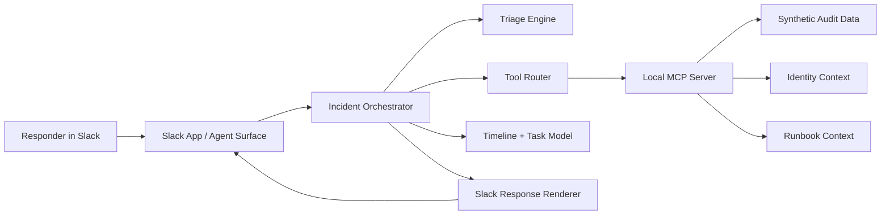

# Architecture

## System Overview

## Components

### Slack App / Agent Surface

Receives Slack interactions, slash commands, app mentions, or workflow triggers. It renders incident briefs, task proposals, timeline updates, and summaries back into Slack.

### Incident Orchestrator

Coordinates the workflow from alert intake to final response. It owns the incident state machine and decides which deterministic tools must be queried before producing an output.

### Triage Engine

Normalizes alerts into a severity, confidence, affected systems, key facts, and missing information. The MVP uses deterministic scoring first, then can layer LLM reasoning on top.

### Tool Router

Provides a clean interface between agent logic and context sources. This keeps the agent from directly depending on Slack, MCP, or demo fixtures.

### MCP Server

Exposes incident-support tools such as:

- `lookup_user_risk`
- `search_audit_events`
- `lookup_app_install`
- `get_runbook`
- `create_timeline_entry`

### Response Renderer

Converts incident state into Slack-ready blocks and concise plain text fallbacks.

## Data Principles

- Demo data is synthetic and stored in the repo.
- Every recommendation should point back to structured facts.
- Timestamps should be UTC.
- Tool failures should be visible in the response instead of hidden.

## MVP Runtime Shape

The initial implementation should run locally with:

- a Slack app process,
- a local MCP/tool process or in-process adapter,
- synthetic JSON fixtures,
- unit tests for triage and rendering.
