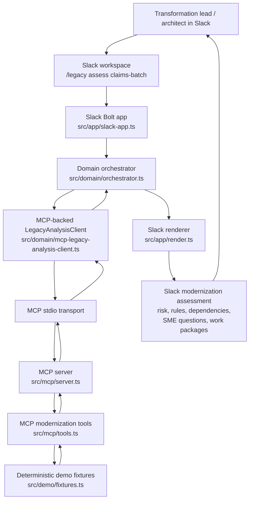

# Architecture Diagram

## Implemented Runtime Path

1. A user invokes `/legacy assess claims-batch` in Slack.
2. The Slack Bolt app receives the slash command through Socket Mode.
3. The domain orchestrator calls the MCP-backed `LegacyAnalysisClient`.
4. The MCP client starts and calls the local MCP server over stdio.
5. The MCP server exposes modernization tools:
   - `legacy.assess_module`
   - `legacy.extract_rules`
   - `legacy.create_plan`
6. The tools read deterministic demo fixture data for repeatable hackathon behavior.
7. The MCP client assembles the final `ModernizationAssessment`.
8. The Slack renderer returns a concise command-center assessment to Slack.
9. The response includes a local MCP tool-call audit summary.

## MVP Boundary

The current MVP intentionally uses deterministic fixture data. The MCP client/server execution path is real; the enterprise data source is synthetic.

Future integrations can replace the fixture-backed tools with real legacy-code analysis services, dependency mappers, Jira/Linear/ServiceNow ticket creation, LLM-backed synthesis, and SME approval workflows.
